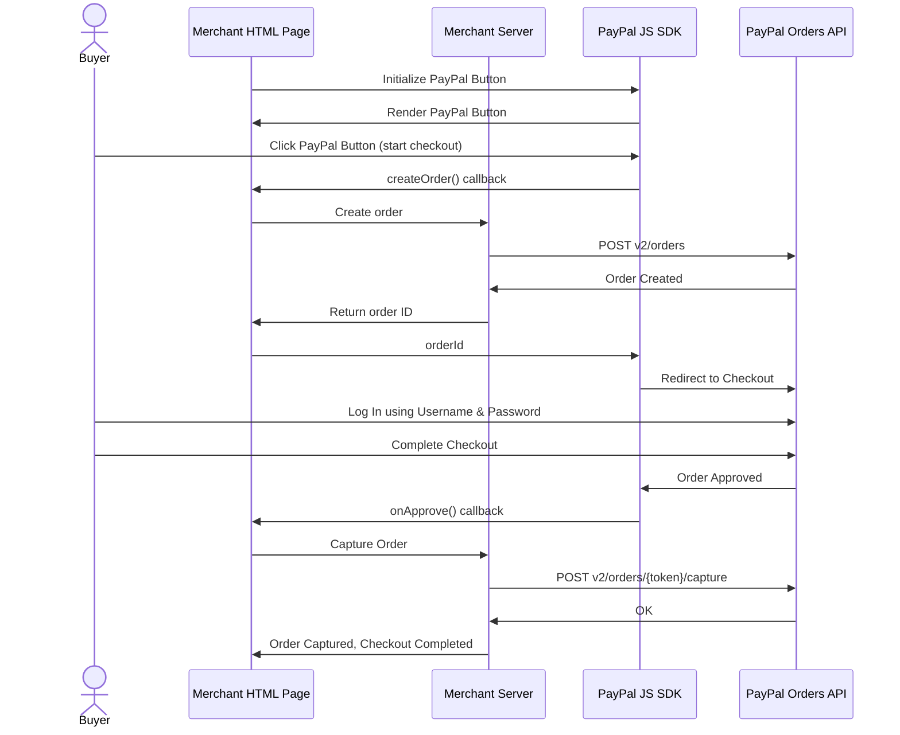

# PayPal Developer Docs Example Code
Examples from the official PayPal Developer Docs

## Merchant Integration Sequence Diagram

```mermaid
sequenceDiagram
  Actor Buyer
  
  participant Merchant HTML Page
  participant Merchant Server
  participant SDK as PayPal JS SDK
  participant PayPal Orders API
  
  Merchant HTML Page->>SDK: Initialize PayPal Button
  SDK->>Merchant HTML Page: Render PayPal Button
  
  Buyer->>SDK: Click PayPal Button (start checkout)
  SDK->>Merchant HTML Page: createOrder() callback
  Merchant HTML Page->>Merchant Server: Create order
  Merchant Server->>PayPal Orders API: POST v2/orders
  PayPal Orders API->>Merchant Server: Order Created
  
  Merchant Server->>Merchant HTML Page: Return order ID
  Merchant HTML Page->>SDK: orderId
  SDK->>PayPal Orders API: Redirect to Checkout
  Buyer->>PayPal Orders API: Log In using Username & Password
  Buyer->>PayPal Orders API: Complete Checkout
  PayPal Orders API->>SDK: Order Approved
  SDK->>Merchant HTML Page: onApprove() callback
  Merchant HTML Page->>Merchant Server: Capture Order
  Merchant Server->>PayPal Orders API: POST v2/orders/{token}/capture
  PayPal Orders API->>Merchant Server: OK
  
  Merchant Server->>Merchant HTML Page: Order Captured, Checkout Completed
```
